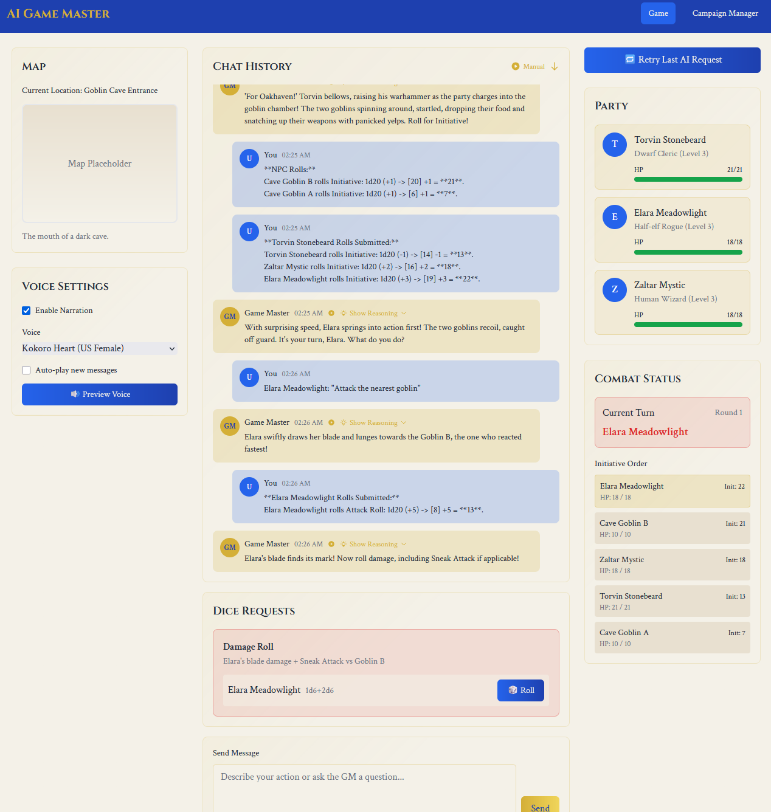

# AI Game Master

> ⚠️ **WARNING: This project is NOT READY for production use**
>
> This is an experimental work-in-progress AI-powered D&D 5e game master. The architecture is still evolving, features are incomplete, and breaking changes occur frequently. Use at your own risk!

An AI-powered web application that attempts to recreate the D&D 5e tabletop experience with an automated game master. Built with FastAPI and Vue.js, it uses large language models for storytelling and game management.



## What You Get

- **AI Dungeon Master**: Storytelling using an LLM that adapts to your choices. Check out [LangChain](https://github.com/langchain-ai/langchain)
- **Smart Combat**: Turn-based battles with initiative tracking and status effects
- **Character Management**: Complete D&D 5e character sheets with automatic calculations
- **Campaign System**: Create, save, and manage multiple adventures
- **Integrated Dice**: Roll with advantage/disadvantage (hopefully, the AI decides), automated skill checks
- **Error Recovery**: Retry system for handling AI hiccups (most used feature...)
- **Persistent State**: Your progress is automatically saved
- **Voice Narration**: Optional text-to-speech using [Kokoro](https://github.com/hexgrad/kokoro) for immersive storytelling
- **Knowledge-Enhanced AI**: Experimental RAG system provides context-aware D&D 5e rules and lore (see [docs/RAG-SYSTEM.md](docs/RAG-SYSTEM.md))

## Quick Start

**Just want to play? One command does it all:**

```bash
# Windows
launch.bat

# macOS/Linux
./launch.sh
```

The basic launcher handles some things automatically:
- Checks prerequisites (Python 3.8+, Node.js 16+)
- Sets up virtual environment
- Installs all dependencies (if you have npm/python installed)
- Builds frontend
- Launches app and opens browser

**Need help?** See [docs/LAUNCHER-GUIDE.md](docs/LAUNCHER-GUIDE.md)

## Configuration

### AI Provider Setup

Create `.env` from template and configure your AI provider:

```bash
cp .env.example .env
```

**Option A: Local Llama.cpp Server (Default)**
```env
AI_PROVIDER=llamacpp_http
LLAMA_SERVER_URL=http://127.0.0.1:8080
AI_RESPONSE_PARSING_MODE=strict  # or 'flexible' for some models
```

**Option B: OpenRouter (Cloud API)**
```env
AI_PROVIDER=openrouter
OPENROUTER_API_KEY=your_openrouter_api_key_here
OPENROUTER_MODEL_NAME=google/gemini-2.5-pro  # or gemini-2.5-flash
AI_RESPONSE_PARSING_MODE=strict
```

### Local Llama.cpp Server

You don't need to use launch_server.py, just have an OpenAI endpoint somewhere.

**Launch a model:**
```bash
# Example: Start Qwen 14B model
python launch_server.py qwen_14b_q6

# See available models
python launch_server.py --help
```

**Configure models** by editing `models.yaml`

### Voice Narration (Optional)

Install `espeak-ng` for text-to-speech narration:
- **Linux**: `sudo apt-get install espeak-ng`
- **macOS**: `brew install espeak-ng`
- **Windows**: Download from [espeak-ng releases](https://github.com/espeak-ng/espeak-ng/releases)

### Performance Optimization

**Disable RAG for faster startup (useful for testing):**
```env
RAG_ENABLED=false  # Skips loading embeddings and knowledge bases
```

**Additional configuration options:**
- `GAME_STATE_REPO_TYPE`: `memory` (fast, volatile) or `file` (persistent)
- `CAMPAIGNS_DIR`: Custom directory for campaign instance saves (default: `saves/campaigns`)
- `CHARACTER_TEMPLATES_DIR`: Custom directory for character templates (default: `saves/character_templates`)
- `CAMPAIGN_TEMPLATES_DIR`: Custom directory for campaign templates (default: `saves/campaign_templates`)

See [docs/CONFIGURATION.md](docs/CONFIGURATION.md) for all options.

## Manual Setup (Advanced)

<details>
<summary>Click to expand manual setup instructions</summary>

1. **Clone repository with submodules:**
   ```bash
   git clone --recurse-submodules https://github.com/mmerah/ai-gamemaster.git
   cd ai-gamemaster
   ```

2. **Backend setup:**
   ```bash
   pip install -r requirements.txt
   cp .env.example .env  # Configure your AI provider
   ```

3. **Database is ready to use:**
   The D&D 5e content database is included with the repository.

4. **Frontend setup:**
   ```bash
   npm --prefix frontend install
   cp frontend/.env.example frontend/.env
   ```

5. **Development mode:**
   ```bash
   # Terminal 1: Backend (http://127.0.0.1:5000)
   python main.py

   # Terminal 2: Frontend (http://localhost:5173)
   npm --prefix frontend run dev
   ```

6. **Production build:**
   ```bash
   npm --prefix frontend run build
   python main.py  # Serves built frontend
   ```

</details>

## Architecture

> 📖 **See [docs/ARCHITECTURE.md](docs/ARCHITECTURE.md) for comprehensive technical architecture documentation**

### Backend
- **Framework**: FastAPI with dependency injection via ServiceContainer
- **API Documentation**: Auto-generated OpenAPI/Swagger docs at `/api/docs`
- **AI Integration**: OpenAI-compatible API clients (llama.cpp, OpenRouter)
- **Event System**: Server-Sent Events (SSE) for real-time updates
- **Type System**: Strongly typed with Pydantic models organized by domain in `app/models/`
- **Game State**: Repository pattern with in-memory or file-based persistence
- **Service Layer**: Domain services for combat, chat, dice, and character management
- **Event Handlers**: Specialized handlers for player actions, dice submissions, turn advancement

### Frontend
- **Framework**: Vue.js 3 with Composition API
- **State Management**: Pinia stores (game, combat, chat, dice, party, UI)
- **Real-time Updates**: SSE event subscription with automatic reconnection
- **Styling**: Tailwind CSS
- **Build**: Vite for development and production

### Key Design Patterns
- **Repository Pattern**: Data access abstraction
- **Service Pattern**: Business logic encapsulation
- **Event-Driven Architecture**: Game state changes via events
- **Dependency Injection**: ServiceContainer manages all dependencies
- **Domain-Driven Design**: Models organized by domain (character, campaign, combat, dice, etc.)

### Important Configuration Constants
- **MAX_AI_CONTINUATION_DEPTH**: Set to 20 in `app/services/game_events/handlers/base_handler.py`
  - Controls automatic AI continuation for complex sequences (e.g., multi-step combat)
  - Prevents infinite loops while allowing lengthy action chains
  - Increase if NPC turns are cut short during complex combat
  - Safety mechanism: If depth limit is reached during an NPC turn, the system will:
    - Force-end the current turn to prevent getting stuck
    - Display a system message explaining what happened
    - Allow players to continue normally or retry

## Game Features

### Game Interface
- **Chat History**: Message history with role distinction and auto-scroll
- **Input Controls**: Message input with dice rolling and quick actions
- **Party Management**: Character display with health bars and status effects
- **Combat System**: Initiative tracking and combat state display
- **Map Integration**: Visual map display with player markers
- **Dice Requests**: Handle GM-requested dice rolls with advantage/disadvantage

### Campaign Manager
- **Campaign CRUD**: Create, edit, delete campaigns with party selection
- **Template System**: Character template management with full D&D 5e stats
- **Grid Layouts**: Beautiful card-based displays
- **Modal Forms**: Professional forms for content creation
- **Status Management**: Campaign lifecycle tracking

## Type System

The application uses a comprehensive type system with Pydantic models organized by domain in `app/models/`:

### Model Organization
- **Base Classes** (`app/models/base.py`): Shared base models and serializers
- **Character Models** (`app/models/character.py`): Character templates, instances, and combined models
- **Campaign Models** (`app/models/campaign.py`): Campaign templates and instances
- **Combat Models** (`app/models/combat.py`): Combat state, combatants, and related models
- **Dice Models** (`app/models/dice.py`): Dice requests, results, and submissions
- **Game State** (`app/models/game_state.py`): Core game state and action models
- **Configuration** (`app/models/config.py`): Service configuration model
- **Utilities** (`app/models/utils.py`): Basic structures and utility models
- **RAG Models** (`app/models/rag.py`): Knowledge base and RAG-specific models
- **Event Models** (`app/models/events.py`): Type-safe event classes for state changes
- **Update Models** (`app/models/updates.py`): Validated game state updates

### Type Safety Features
- **Zero mypy errors**: Full static type checking compliance
- **Strong typing**: All models use Pydantic for runtime validation
- **Cross-stack safety**: TypeScript interfaces auto-generated from Python models (`frontend/src/types/unified.ts`)
- **Runtime validation**: Pydantic models validate all data at runtime
- **Automatic synchronization**: Run `python scripts/dev/generate_ts.py` to keep frontend types in sync

## Development

### Code Quality Tools

This project uses automated tools to maintain code quality:

#### Pre-commit Hooks

Pre-commit hooks run automatically before each commit to ensure code quality:

```bash
# Install pre-commit
pip install pre-commit

# Install the git hooks
pre-commit install

# Run hooks manually on all files
pre-commit run --all-files
```

The hooks will:
- **Lint and format** code with `ruff` (combining black, isort, flake8)
- **Type check** `app/`, `tests/`, and `main.py` with `mypy --strict`
- **Auto-fix** common issues like import sorting and formatting

#### Development Tools

All Python development tools are configured in `pyproject.toml`:

- **Ruff**: Fast linting and formatting (combines black, isort, flake8)
- **Mypy**: Static type checking with strict mode
- **Pytest**: Test runner with custom markers

Run manually:
```bash
ruff check .          # Check for issues
ruff check . --fix    # Auto-fix issues
ruff format .         # Format code
mypy app --strict     # Type check
pytest                # Run tests
```

### Backend Commands
```bash
python main.py                   # Development server

# Testing (fast mode with RAG disabled)
python tests/run_all_tests.py   # Run all tests
python tests/run_all_tests.py unit      # Unit tests only
python tests/run_all_tests.py coverage  # With coverage report

# See docs/TESTING.md for more testing options
```

### Frontend Commands
```bash
npm --prefix frontend run dev      # Development server with hot reload
npm --prefix frontend run build    # Production build
npm --prefix frontend run preview  # Preview production build
npm --prefix frontend run lint     # Lint code
```

## AI Model Performance

> See [docs/MODEL-PERFORMANCE.md](docs/MODEL-PERFORMANCE.md) for detailed AI model testing results

**Quick recommendations:**
- **Best overall**: Gemini 2.5 Pro (cloud API)
- **Best value**: Gemini 2.5 Flash (cloud API)
- **Best local**: Qwen3 32B or Mistral-Small 24B
- **Fast local**: Qwen3 30B A3B
- **Entry-level**: Qwen3 14B

## License

This project is licensed under the MIT License - see the LICENSE file for details.
